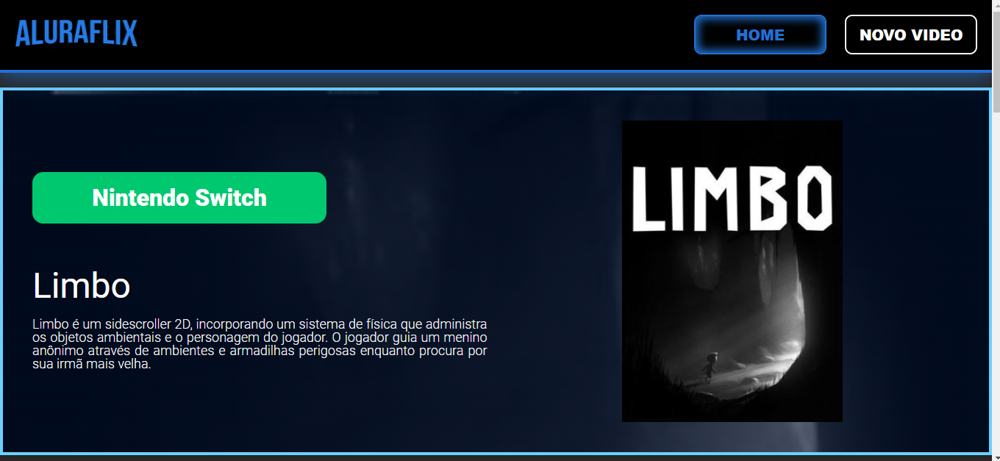

# Alura Flix

## Sobre o Projeto

O Alura Flix é uma aplicação desenvolvida para o challenge AluraFlix do Oracle Next Education. Esta aplicação permite ao usuário guardar diversos gameplays e os separa de acordo com o sistema ou plataforma. Também é possível editar os cards e excluí-los, além de conseguir adicionar novos sistemas.

## Tecnologias Utilizadas

- **React**
- **Vite**
- **Styled Components**
- **react-router-dom**
- **Axios**

## Funcionalidades

- **Adicionar Gameplay:** Formulário para inserção de novos gameplays com nome, sistema e URL do vídeo.
- **Listar Gameplays:** Exibição dos gameplays cadastrados em cards na interface.
- **Editar Gameplay:** Funcionalidade para editar os detalhes dos gameplays existentes.
- **Deletar Gameplay:** Funcionalidade para remover gameplays da lista.
- **Adicionar Sistema:** Possibilidade de adicionar novos sistemas/plataformas.

## Aprendizados

Durante o desenvolvimento deste projeto, pude aprender e aplicar os seguintes conceitos:

- Estruturação de uma aplicação completa utilizando React.
- Utilização do Vite para configuração do ambiente de desenvolvimento.
- Estilização de componentes utilizando Styled Components.
- Implementação de navegação com react-router-dom.
- Consumo de API utilizando Axios.
- Aplicação do conceito de mobile first para criar um layout responsivo.

## Quadros e Modelos

Para a montagem do projeto foi nos fornecido um Figma e para a realização das tarefas também foi nos fornecido um quadro no Trello.

- Modelo Figma: [Figma - New AluraFlix](https://www.figma.com/design/06e5IXeOVl8QvA3mm4TENR/New-AluraFlix---PT?node-id=1-106&t=hZCjwhyUa4dD113n-0)
- Trello: [Trello - New AluraFlix](https://trello.com/b/IKEVUOor/new-aluraflix-pt)
